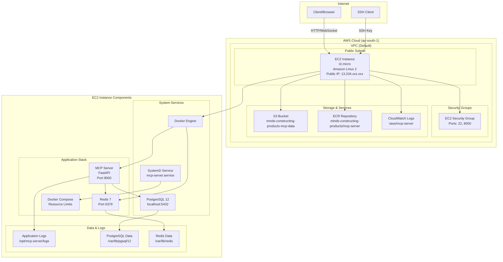

# MCP Server AWS Infrastructure - Architecture Analysis & Troubleshooting Guide

## 🏗️ **Complete Architecture Flow Diagram**



## 📊 **Infrastructure Components Checklist**

### ✅ **AWS Resources Deployed**
- [x] **EC2 Instance** (t2.micro, Amazon Linux 2)
- [x] **Security Groups** (Ports 22, 8000 open)
- [x] **S3 Bucket** (minds-constructing-products-mcp-data)
- [x] **ECR Repository** (minds-constructing-products/mcp-server)
- [x] **CloudWatch Logs** (/aws/mcp-server)
- [x] **Public IP** (for SSH access)

### ✅ **Application Stack**
- [x] **Docker Engine** (for containerization)
- [x] **Docker Compose** (for orchestration)
- [x] **PostgreSQL 12** (local database)
- [x] **Redis 7** (caching & sessions)
- [x] **MCP Server** (FastAPI application)
- [x] **SystemD Service** (auto-restart)

### ✅ **Security & Networking**
- [x] **SSH Access** (port 22)
- [x] **HTTP Access** (port 8000)
- [x] **Public IP** (for external access)
- [x] **Security Groups** (restricted access)

## 🔍 **Comprehensive Troubleshooting Guide**

### **1. SSH Connectivity Check**

```bash
# Check if you can SSH to the instance
ssh -i "Minds-Constructing-Products-key.pem" ec2-user@<PUBLIC_IP>

# If SSH fails, check:
# - Key permissions: chmod 400 Minds-Constructing-Products-key.pem
# - Security group allows port 22
# - Instance is running
```

### **2. System Services Status**

```bash
# Check system services
sudo systemctl status docker
sudo systemctl status postgresql-12
sudo systemctl status mcp-server.service

# Check if services are enabled
sudo systemctl is-enabled docker
sudo systemctl is-enabled postgresql-12
sudo systemctl is-enabled mcp-server.service
```

### **3. Docker & Application Status**

```bash
# Check Docker containers
cd /opt/mcp-server
docker-compose ps
docker-compose logs mcp-server
docker-compose logs redis

# Check if containers are running
docker ps -a

# Check resource usage
docker stats
```

### **4. Database Connectivity**

```bash
# Test PostgreSQL connection
sudo -u postgres psql -c "SELECT version();"
sudo -u postgres psql -c "SELECT current_database();"
sudo -u postgres psql -c "SELECT * FROM pg_user;"

# Test database from application
sudo -u postgres psql -d mcp_assistant -c "SELECT 1;"
```

### **5. Application Health Checks**

```bash
# Check if MCP server is responding
curl -f http://localhost:8000/
curl -f http://localhost:8000/tools

# Check WebSocket endpoint
curl -i -N -H "Connection: Upgrade" -H "Upgrade: websocket" -H "Sec-WebSocket-Version: 13" -H "Sec-WebSocket-Key: x3JJHMbDL1EzLkh9GBhXDw==" http://localhost:8000/mcp
```

### **6. Log Analysis**

```bash
# Check application logs
tail -f /opt/mcp-server/logs/mcp-server.log
tail -f /opt/mcp-server/logs/*.log

# Check system logs
sudo journalctl -u mcp-server.service -f
sudo journalctl -u docker.service -f
sudo journalctl -u postgresql-12.service -f

# Check Docker logs
docker-compose logs -f
```

### **7. Resource Monitoring**

```bash
# Check system resources
free -h
df -h
top
htop

# Check memory usage
cat /proc/meminfo
cat /proc/cpuinfo

# Check disk usage
du -sh /opt/mcp-server/*
du -sh /var/lib/pgsql/12/data
```

### **8. Network Connectivity**

```bash
# Check network interfaces
ip addr show
netstat -tulpn

# Check if ports are listening
sudo netstat -tulpn | grep :8000
sudo netstat -tulpn | grep :6379
sudo netstat -tulpn | grep :5432

# Test external connectivity
curl -I https://www.google.com
ping -c 3 8.8.8.8
```

### **9. Security Group Verification**

```bash
# Check if security group allows required ports
aws ec2 describe-security-groups --group-ids sg-061c972b669099b59 --region ap-south-1

# Test from external
telnet <PUBLIC_IP> 22
telnet <PUBLIC_IP> 8000
```

### **10. Application-Specific Checks**

```bash
# Check MCP server configuration
cat /opt/mcp-server/.env
cat /opt/mcp-server/docker-compose.yml

# Test Redis connection
redis-cli ping
redis-cli info memory

# Test PostgreSQL from Docker
docker exec -it $(docker-compose ps -q mcp-server) psql $POSTGRES_URL -c "SELECT 1;"
```

## 🚨 **Common Issues & Solutions**

### **Issue 1: SSH Connection Failed**
```bash
# Solution: Check key permissions and public IP
chmod 400 Minds-Constructing-Products-key.pem
ssh -i "Minds-Constructing-Products-key.pem" ec2-user@<PUBLIC_IP>
```

### **Issue 2: Application Not Starting**
```bash
# Solution: Check Docker and restart services
sudo systemctl restart docker
cd /opt/mcp-server
docker-compose down
docker-compose up -d
```

### **Issue 3: Database Connection Failed**
```bash
# Solution: Restart PostgreSQL and check configuration
sudo systemctl restart postgresql-12
sudo -u postgres psql -c "SELECT pg_is_in_recovery();"
```

### **Issue 4: Memory Issues (t2.micro)**
```bash
# Solution: Optimize memory usage
echo "vm.swappiness=10" >> /etc/sysctl.conf
sysctl vm.swappiness=10
docker system prune -f
```

### **Issue 5: Port Not Accessible**
```bash
# Solution: Check security groups and firewall
sudo iptables -L
aws ec2 describe-security-groups --group-ids sg-061c972b669099b59
```

## 📈 **Performance Monitoring**

### **Resource Usage Thresholds**
- **CPU**: >80% for extended periods
- **Memory**: >90% usage
- **Disk**: >85% usage
- **Network**: Monitor bandwidth usage

### **Application Metrics**
- **Response Time**: <2 seconds
- **Error Rate**: <1%
- **Uptime**: >99.5%

## 🔧 **Maintenance Commands**

```bash
# Update system
sudo yum update -y

# Restart services
sudo systemctl restart mcp-server.service

# Backup database
sudo -u postgres pg_dump mcp_assistant > backup.sql

# Clean up Docker
docker system prune -f
docker volume prune -f

# Rotate logs
sudo logrotate -f /etc/logrotate.d/mcp-server
```

## 🎯 **Expected Behavior**

### **✅ Working State Indicators**
1. **SSH Access**: `ssh -i key.pem ec2-user@<PUBLIC_IP>` works
2. **HTTP Response**: `curl http://<PUBLIC_IP>:8000/` returns 200
3. **WebSocket**: Can connect to `ws://<PUBLIC_IP>:8000/mcp`
4. **Database**: PostgreSQL running and accessible
5. **Redis**: Redis running and responding to ping
6. **Logs**: Application logs being generated
7. **Services**: All systemd services are active

### **📊 Health Check Endpoints**
- **Health**: `GET /` → 200 OK
- **Tools**: `GET /tools` → List of available tools
- **WebSocket**: `WS /mcp` → MCP protocol endpoint
- **Metrics**: Check logs for performance data

This comprehensive guide should help you verify that your MCP server infrastructure is working correctly and troubleshoot any issues that arise. 