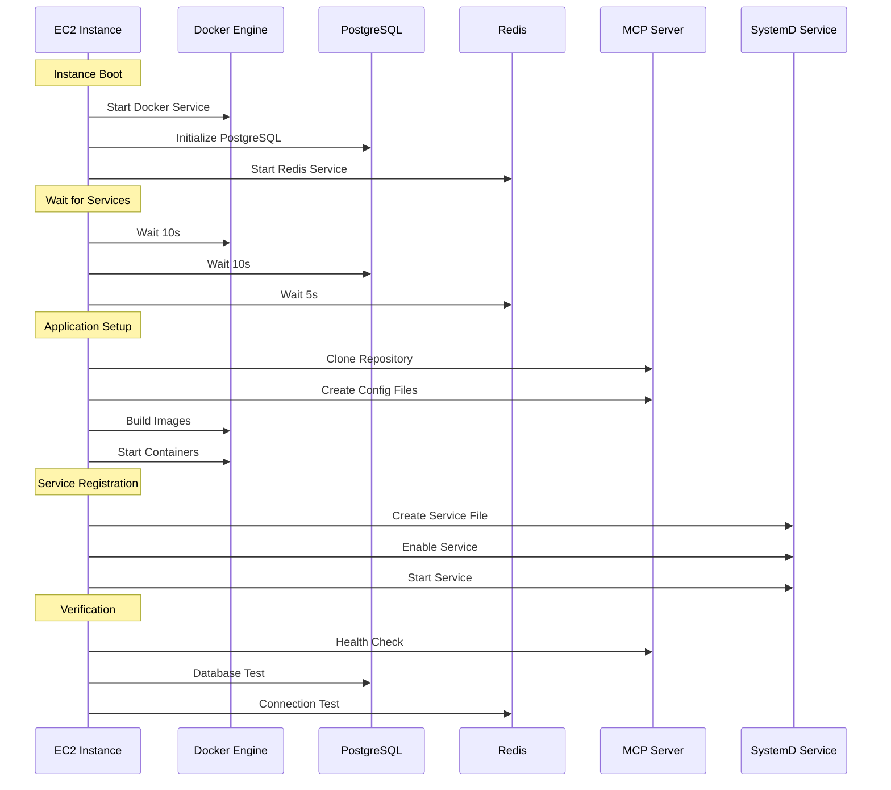
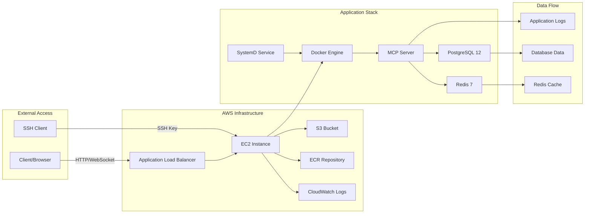
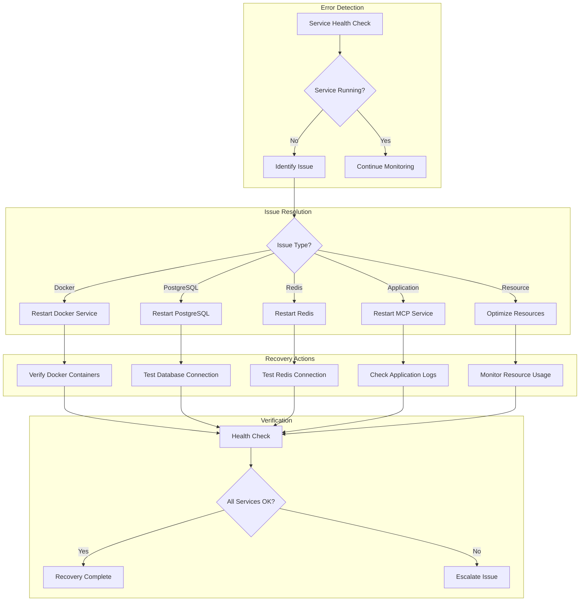
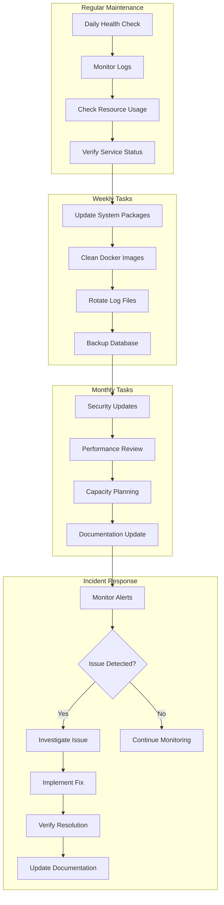
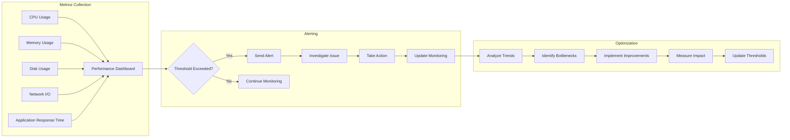

# MCP Server AWS Infrastructure - Complete Workflow Diagram

## 🏗️ **Infrastructure Deployment Workflow**

```mermaid
graph TD
    subgraph "Phase 1: Infrastructure Setup"
        A[Start Terraform Deployment] --> B[Create VPC & Security Groups]
        B --> C[Deploy EC2 Instance t2.micro]
        C --> D[Assign Public IP]
        D --> E[Create S3 Bucket]
        E --> F[Create ECR Repository]
        F --> G[Setup CloudWatch Logs]
    end
    
    subgraph "Phase 2: System Initialization"
        G --> H[EC2 Instance Boots]
        H --> I[User Data Script Executes]
        I --> J[Install System Packages]
        J --> K[Setup Docker Engine]
        K --> L[Install Docker Compose]
        L --> M[Initialize PostgreSQL 12]
        M --> N[Setup Redis Service]
    end
    
    subgraph "Phase 3: Application Deployment"
        N --> O[Clone MCP Repository]
        O --> P[Create Environment Config]
        P --> Q[Build Docker Images]
        Q --> R[Start Application Containers]
        R --> S[Setup SystemD Service]
        S --> T[Enable Auto-restart]
    end
    
    subgraph "Phase 4: Verification & Monitoring"
        T --> U[Health Check Services]
        U --> V[Test Database Connectivity]
        V --> W[Verify Application Endpoints]
        W --> X[Monitor Resource Usage]
        X --> Y[Setup Log Rotation]
        Y --> Z[Infrastructure Ready]
    end
```

## 🔄 **Service Startup Sequence**

## 📊 **Operational Workflow**

## 🚨 **Error Handling & Recovery Workflow**

## 📋 **Deployment Checklist**

### **✅ Pre-Deployment**
- [x] Terraform configuration validated
- [x] AWS credentials configured
- [x] SSH key pair created
- [x] Required ports available (22, 8000)

### **✅ Infrastructure Deployment**
- [x] VPC and security groups created
- [x] EC2 instance launched with public IP
- [x] S3 bucket and ECR repository created
- [x] CloudWatch log group configured

### **✅ System Services**
- [x] Docker Engine installed and running
- [x] Docker Compose installed
- [x] PostgreSQL 12 initialized and running
- [x] Redis service started
- [x] SystemD service configured

### **✅ Application Deployment**
- [x] MCP repository cloned
- [x] Environment configuration created
- [x] Docker images built
- [x] Containers started successfully
- [x] Health checks passing

### **✅ Verification & Monitoring**
- [x] SSH access working
- [x] HTTP endpoints responding
- [x] Database connectivity verified
- [x] Redis connectivity verified
- [x] Logs being generated
- [x] Resource usage within limits

## 🔧 **Maintenance Workflow**

## 📈 **Performance Monitoring Workflow**

## 🎯 **Success Criteria**

### **✅ Infrastructure Success**
- EC2 instance accessible via SSH
- Public IP assigned and reachable
- Security groups properly configured
- All AWS resources created successfully

### **✅ Application Success**
- MCP server responding on port 8000
- WebSocket endpoint accessible
- Database connections working
- Redis cache operational
- Logs being generated properly

### **✅ Operational Success**
- SystemD service auto-restarting
- Health checks passing
- Resource usage within limits
- Error rates below 1%
- Response times under 2 seconds

This workflow ensures a robust, scalable, and maintainable MCP server infrastructure on AWS. 