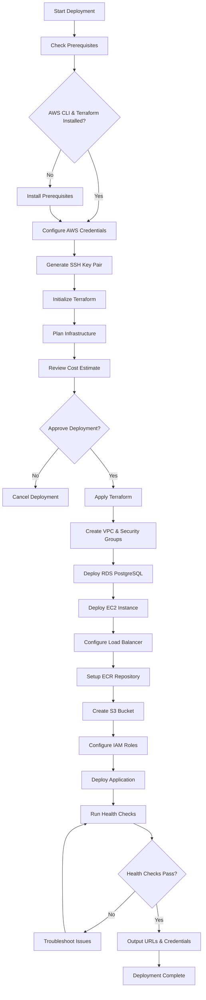

# MCP Server AWS Deployment Workflow

## 🔄 Deployment Workflow Diagram



## 📋 Detailed Deployment Steps

### Phase 1: Prerequisites & Setup
1. **Install Tools**
   ```bash
   # Install Terraform
   curl -fsSL https://apt.releases.hashicorp.com/gpg | sudo apt-key add -
   sudo apt-add-repository "deb [arch=amd64] https://apt.releases.hashicorp.com $(lsb_release -cs) main"
   sudo apt-get update && sudo apt-get install terraform

   # Install AWS CLI
   curl "https://awscli.amazonaws.com/awscli-exe-linux-x86_64.zip" -o "awscliv2.zip"
   unzip awscliv2.zip
   sudo ./aws/install
   ```

2. **Configure AWS**
   ```bash
   aws configure
   # Enter your AWS Access Key ID
   # Enter your AWS Secret Access Key
   # Enter region: ap-south-1
   # Enter output format: json
   ```

### Phase 2: Infrastructure Deployment
1. **Initialize Terraform**
   ```bash
   cd MCP-hackathon/terraform
   terraform init
   ```

2. **Review Plan**
   ```bash
   terraform plan
   ```

3. **Deploy Infrastructure**
   ```bash
   terraform apply
   ```

### Phase 3: Application Deployment
1. **SSH to Instance**
   ```bash
   ssh -i ssh/mcp-server-key ec2-user@$(terraform output -raw mcp_server_public_ip)
   ```

2. **Verify Application**
   ```bash
   # Check application status
   sudo systemctl status mcp-server.service

   # Check logs
   sudo journalctl -u mcp-server.service -f

   # Test health endpoint
   curl http://localhost:8000/
   ```

## 🔧 Configuration Management

### Environment Variables
```bash
# Application Configuration
HOST=0.0.0.0
PORT=8000
SECRET_KEY=<auto-generated>

# Database Configuration
POSTGRES_URL=postgresql://mcp_admin:<password>@<rds-endpoint>:5432/mcp_assistant
REDIS_URL=redis://localhost:6379

# AWS Configuration
AWS_REGION=ap-south-1
S3_BUCKET=minds-constructing-products-mcp-data
```

### Security Configuration
- **EC2 Security Group**: Ports 22 (SSH), 8000 (HTTP)
- **RDS Security Group**: Port 5432 (PostgreSQL) from EC2 only
- **ALB Security Group**: Port 80 (HTTP) from internet

## 📊 Monitoring Setup

### CloudWatch Metrics
- **EC2**: CPU, Memory, Network
- **RDS**: CPU, Memory, Storage, Connections
- **ALB**: Request count, Target response time

### Log Aggregation
```bash
# Application logs
/opt/mcp-server/logs/

# System logs
sudo journalctl -u mcp-server.service

# CloudWatch logs
/aws/mcp-server
```

## 🚨 Health Check Procedures

### Application Health
```bash
# Check application status
curl -f http://localhost:8000/

# Check WebSocket endpoint
curl -f http://localhost:8000/mcp

# Check database connection
psql -h <rds-endpoint> -U mcp_admin -d mcp_assistant -c "SELECT 1;"
```

### Infrastructure Health
```bash
# Check EC2 instance
aws ec2 describe-instances --instance-ids <instance-id>

# Check RDS status
aws rds describe-db-instances --db-instance-identifier mcp-postgres

# Check ALB health
aws elbv2 describe-target-health --target-group-arn <target-group-arn>
```

## 🔄 Scaling Procedures

### Vertical Scaling (Manual)
```bash
# Scale EC2 instance
aws ec2 modify-instance-attribute --instance-id <id> --instance-type "t4g.large"

# Scale RDS instance
aws rds modify-db-instance --db-instance-identifier mcp-postgres --db-instance-class "db.t4g.medium"
```

### Horizontal Scaling (Future)
- Add multiple EC2 instances behind ALB
- Use RDS read replicas for read scaling
- Implement auto-scaling groups

## 🛡️ Security Hardening

### Network Security
- Use private subnets for RDS
- Implement VPC endpoints for AWS services
- Configure network ACLs

### Application Security
- Enable HTTPS with SSL certificates
- Implement API rate limiting
- Use AWS Secrets Manager for sensitive data

### Access Control
- Implement least privilege IAM policies
- Enable AWS CloudTrail for audit logs
- Regular security group reviews

## 📈 Performance Optimization

### Database Optimization
- Enable RDS Performance Insights
- Configure connection pooling
- Implement query optimization

### Application Optimization
- Enable Redis caching
- Implement CDN for static content
- Use connection pooling

### Infrastructure Optimization
- Use GP3 EBS volumes for better performance
- Enable RDS storage autoscaling
- Implement CloudWatch alarms

## 🧹 Cleanup Procedures

### Complete Cleanup
```bash
# Destroy all resources
terraform destroy

# Remove SSH keys
rm -rf ssh/

# Clean up local files
rm -rf .terraform/
rm terraform.tfstate*
```

### Partial Cleanup
```bash
# Remove specific resources
terraform destroy -target=aws_instance.mcp_server
terraform destroy -target=aws_db_instance.mcp_postgres
```

## 📞 Support & Troubleshooting

### Common Issues & Solutions

1. **Application not starting**
   - Check system resources: `htop`
   - Verify Docker service: `sudo systemctl status docker`
   - Check application logs: `sudo journalctl -u mcp-server.service`

2. **Database connection issues**
   - Verify RDS endpoint: `aws rds describe-db-instances`
   - Check security groups: `aws ec2 describe-security-groups`
   - Test connectivity: `telnet <rds-endpoint> 5432`

3. **Load balancer health checks failing**
   - Check target group health: `aws elbv2 describe-target-health`
   - Verify application is listening: `netstat -tlnp | grep 8000`
   - Check security group rules

### Emergency Procedures
1. **Instance down**: Restart EC2 instance
2. **Database down**: Check RDS status and restart if needed
3. **Application down**: SSH to instance and restart service
4. **Load balancer issues**: Check target group health and security groups

---

**Team**: Minds-Constructing-Products  
**Last Updated**: $(date)  
**Version**: 1.0 